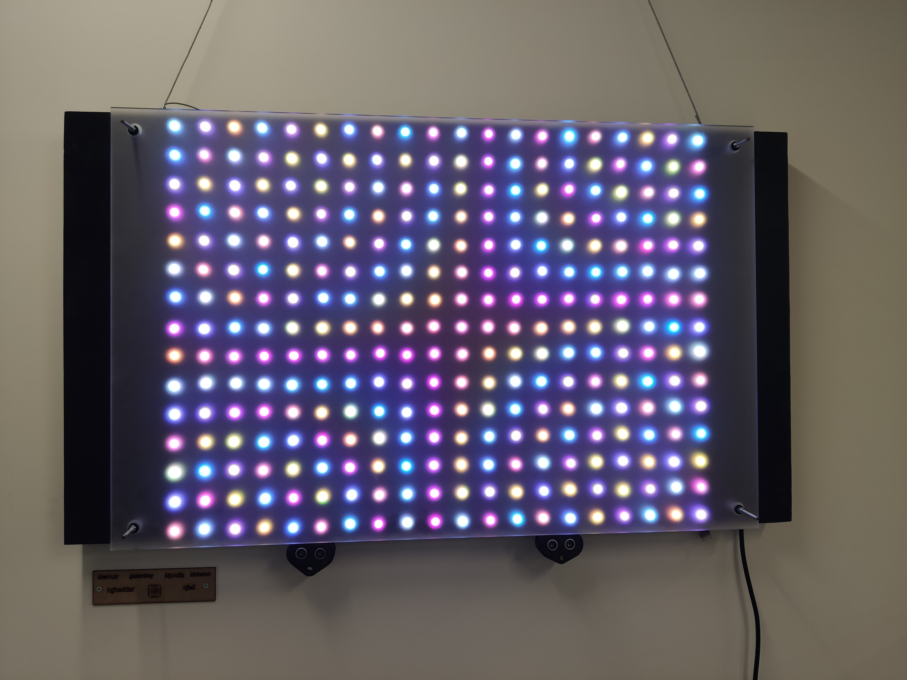
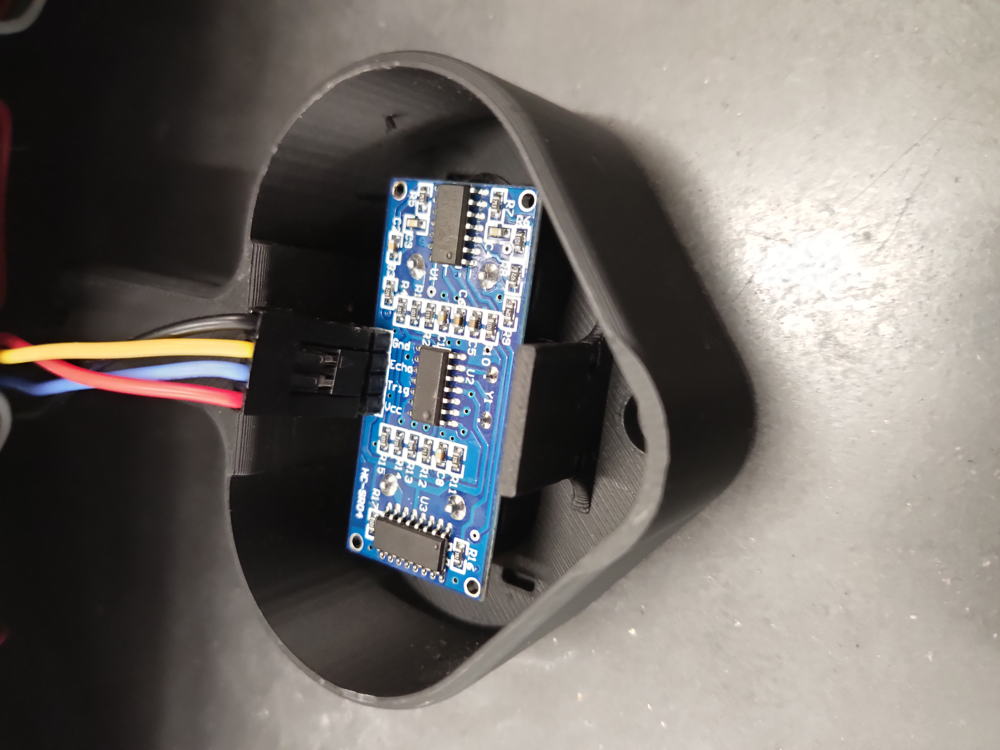
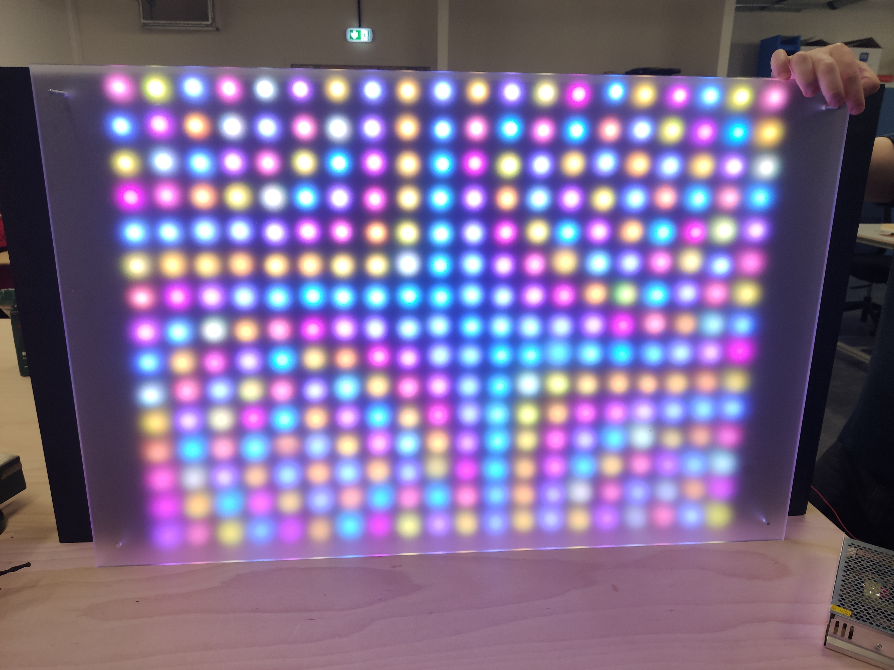
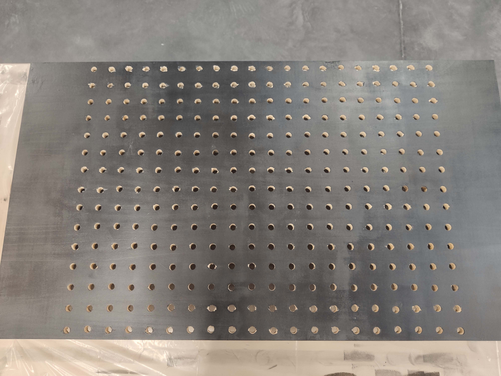

<h1 align=center>42_LED_MATRIX</h1>

  

An educational electronics project built after attending the **42 Embedded Pool**, showcased during the opening night of the new 42 Paris building, in partnership with **42’s Electronics Lab (Labelec)**.

## 🧠 Project Overview

At 42, during the common core, we mostly study computer science and spend a lot of time in front of a screen (which I don’t dislike!). This project was a great opportunity to step away from pure software and **build a tangible, real-time system**, dealing with **physical constraints and hardware limitations**.

The original idea was to create an LED matrix displaying geometric animations that would morph based on the viewer’s distance. Due to time constraints and imperfect hardware choices (ultrasonic sensors being imprecise and tricky to work with), the sensors ultimately became triggers for predefined animations instead.

It was made in about two months.

## ⚙️ Hardware & Architecture

The project runs on an **ESP32**, using the **RMT module** to send color data to **WS2811 addressable LEDs** asynchronously. The LEDs are chained in series: each LED consumes its data and forwards the rest to the next one.

Because ultrasonic distance measurements are blocking by nature, they initially interfered with animation playback. To handle this, **multithreading** was originally implemented to **meet real-time constraints** and keep animations smooth.

The project uses the ESP-IDF libray. Other then that, it is written entirely in C.

## Components

- ESP32

- 300 WS2811 addressable LEDs

- 2× HC-SR04 ultrasonic distance sensors

- Sound sensor, in a 3D printed casing

## 🧪 Lessons Learned

- Designing for real-time constraints is very different from pure software

- Hardware choices matter (a lot!)

- Multithreading is often unavoidable in interactive systems

- Prototyping in the physical world is messy—but very rewarding

## 🖼️ Gallery

  
  
  
  
  
  
  
  

  

##
<!-- 

  
  

    This project would not have been possible without the support and guidance of 42’s Labelec, as well as the 42 staff who funded the project.
    Many thanks to them !
  

 -->

<table>
  <tr>
    <td width="120">
      
    </td>
    <td align="center">
      This project would not have been possible without the support and guidance of
      <strong>42’s Labelec</strong>, as well as the <strong>42 staff</strong> who funded the project.
       
      Many thanks to them!
    </td>
  </tr>
</table>
